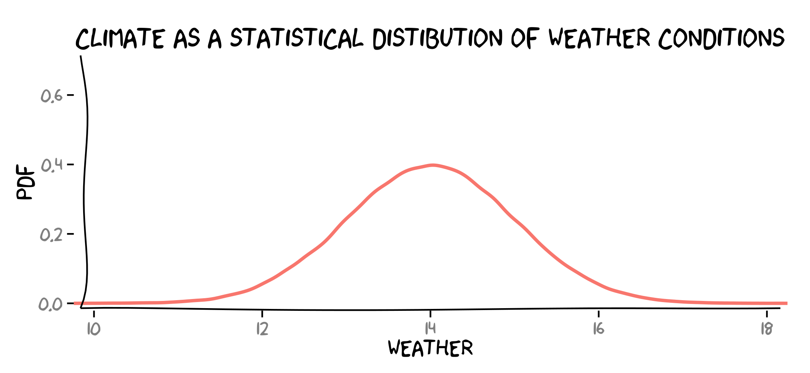
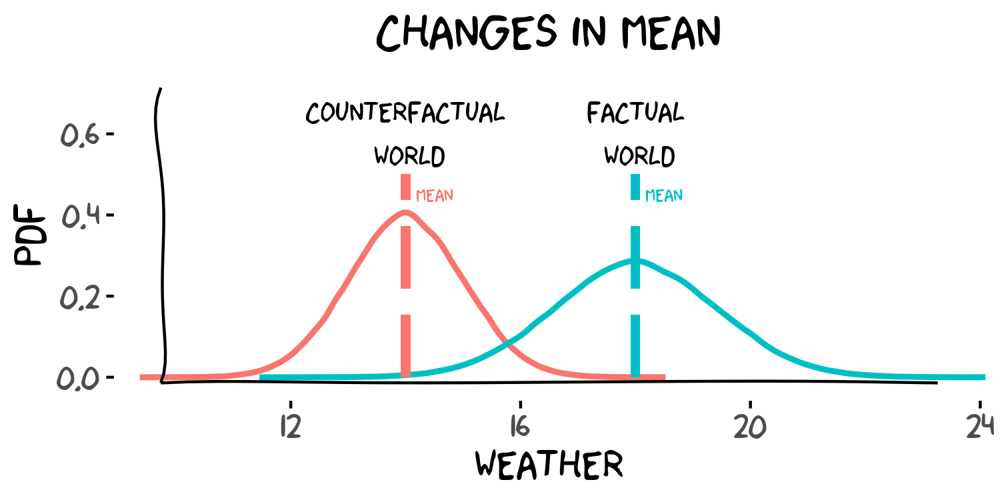
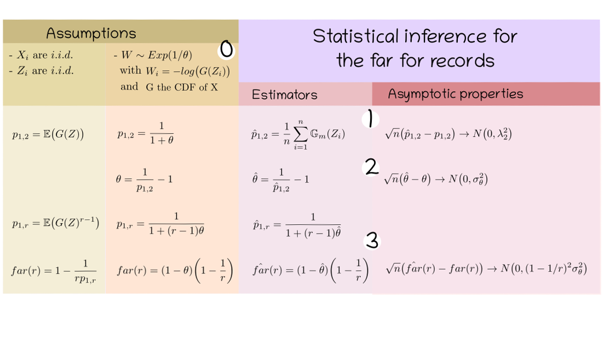

<style>
body {
text-align: justify}
</style>


```{r setup, echo=FALSE, results="hide", error=TRUE, warning=FALSE, message=FALSE}
knitr::opts_chunk$set(echo = TRUE)
```

## Introduction

The aim of this vignette is to provide a quick introduction to the package `farr`. The package provides a set of functions to estimate the $far$, the fraction of attributable risk for record events. The $far$ was introduced in @naveau_revising_2018. The original code was provided by [Philippe Naveau](https://www.lsce.ipsl.fr/Phocea/Pisp/visu.php?id=44) and I simply put the code in a package format. Be aware that errors could have been introduced in the process. the R package `farr` is available in  [Github](https://github.com/thaos/farr). It can be installed from R using the package `devtools` with the following command: 

```{r farr_installation, echo=TRUE, eval=FALSE, include=TRUE}
library(devtools)
devtools::install_github("thaos/farr")
```
This vignette is divided in 3 parts:

1. A brief presentation of what the $far$ is and the context it is used in.

1. Toys example to present how to use the 'farr' package.

2. An example close to an actual climate application to give an idea of how this method can be applied in climate sciences. We will show how to repoduce part of the results of @naveau_revising_2018.


**Remark:** *This vignettes is originally made for me as a reminder of what I learned about the $far$ but I hope it could be also useful to others. This vignette reflects my level of understanding of the topic and thus it could contain mistakes or erroneous information (I hope not too big nor too many).
Constructive comments or suggestions on possible ways to improve this document are welcome. For instance, it could be about better ways to explain or illustrate certain ideas or tips about more efficient ways to program in R. Corrections related to the English language are also welcome.*

## Event attribution, the FAR and the far.

### Attribution of climate change
The $far$ was proposed by @naveau_revising_2018 as one possible tool to tackle the question of event attribution. Event attribution is a sub-field of the attribution of climate change. In the following, we will to provide a brief idea of what attribution of climate change is but for more detailed explanation see for instance @bindoff_detection_2013 or @stott_attribution_2016. The field of attribution of climate change aims to explain observed (or more precisely detected) changes in the climate and provide the causes of thoses changes. One particular focus of attribution of climate change is the effect of human activity on the climate. One way of assessing whether human activity has a significant causal impact on the climate is through the concept of counterfactuals [@hannart_causal_2016]. For instance, how different would the climate be today if human activity stayed at the same level as the pre-industrial ? By comparing the factual world ( the world as it is) with the counterfactual world (a world that could have been), one can assess the causal role of a given factor. 

In climate sciences, we often make the analogy that climate is a probabilistic distribution and weather is one realization of this distribution.




Following this analogy, the attribution of climate change from a causal counterfactual theory standpoint would consist in comparing two probabilistic distributions representing two climates, one for the factual world and the other for counterfactual world. First studies of climate change attribution aimed at explaining long-term changes in the mean of the distribution. 



### (Extreme) event attribution
With the same analogy, event attribution compares in this case the probability of having one event (defined as a set of possible outcomes of the distribution) occuring in the factual and counterfactual world. When talking about extreme event attribution, one would focus on the tail of the distribution. In this case, the class of event most usually studied in the litterature are thresholds exceedences, i.e. an event is to said to have occured when a univariate variable exceed a given threshold. 


In the figure above, let us consider that $Z$ is the climate variable of interest in the factual world  and $X$ is the corresponding variable in the counterfactual world. The event is defined as the variable of interest exceending the threshold $RL$ (standing for Return Level) which gives $\{Z > RL\}$ for the factual world  and  $\{X > RL\}$ for the counterfactual world. Then, we want to compare the probability of having this event in both worlds:

\begin{align}
p_0 &= P( X > RL) & \text{for the counterfactual world} \\
p_1 &= P( Z > RL) & \text{for the factual world} 
\end{align}

### The $FAR$ (Fraction of Attributable Risk)
In climate science, the $FAR$ (Fraction of Attributable Risk) has been introduced by @stott_human_2004 to provide a synthetic number for this comparison:

$$ FAR = \dfrac{p_1 - p_0}{p_1} = 1 - \dfrac{p_0}{p_1} $$
Where $p_1$ corresponds to the probability of having the event in factual world and $p_0$ the probability of having the same event in conterfactual world. When the $FAR$is significatively different from zero, it means that the conjonction of factors that were "added" in the factual world with respect to the counterfactual world has a causal effect on the event of interest. 

For instance, if we were interesting in the event that the annual average temperature over exceeding 40 degrees and we want to assess the causal role of anthropogenic forcings, we would compare the probability of having this event in our factual world and the probability of having the same event in an idealized, counterfactual world were the anthorpogic forcings remained null. If the $FAR$ were to be significatively different from 0, we would deduce that anthropogenic forcings have a causal effect on having annual average temperature above 40 degrees in Europe.

@hannart_causal_2016 mentionned that the $FAR$ can be also interpreted as the probability of necessary causation in Pearl's probabilistic causal theory [@pearl_probabilities_1999] 


### The $far$ (fraction of attributable risk for records)

@naveau_revising_2018 presents statistical methods to estimate the FAR for a different class of events: records.

#### Records

@naveau_revising_2018 follows the definition of records provided in @resnick_extreme_1987.
For a time-serie $\mathbf{Y} = (Y_1, Y_2, \ldots, Y_T)$ a new record is broken at time $r$ if the observed value  $Y_r$ is strictly higher than all previous observed values:
$$ Y_r > \max(Y_1, \ldots, Y_{r-1})$$

In particular, when the random variables $Y_t$ are independently and identically distributed ($i.i.d.$), the probability of observing a record at time $r$ is:
$$ P \big[Y_r > \max(Y_1, \ldots, Y_{r-1})\big] =  \dfrac{1}{r} $$
For $i.i.d$ variables, as we could have intuitively guessed, the longer the time-series, the harder (less likely) it is to break a new record. 

#### Record events in the factual and counterfactual worlds

One key idea of the article is to take advantage of the former result for the attribution of event that are records. Indeed, as mentionned earlier, a lot of attribution studies aim at assessing the causal effect of human activity on a given event. Thus, the factual world is defined as the climate response when taking into account anthropogenic and natural forcings in the climate system whereas the counterfactual world correspond to the climate response that we would have if only natural forcings were present. Let us denote $\mathbf{Z} = (Z_1, Z_2, \ldots, Z_T)$ and $\mathbf{X} = (X_1, X_2, \ldots, X_T)$ the time-series of our variable of interest in the factual world and the counterfactual world respectively. The event we are looking at is defined as having a record at time $r$ :

\begin{align}
X_r &> \max(X_1, \ldots, X_{r-1}) & \text{for the counterfactual world} \\
Z_r &> \max(X_1, \ldots, X_{r-1}) & \text{for the factual world} 
\end{align}

When the climate is only driven by natural forcings, it is sometimes reasonnable to assume that the climate in the counterfactual world is stationnary and that the time-series $X$ is also stationnary. If we furthermore assume that random variables $X_t$ are $i.i.d.$, then we directly have the probably of having a record after a sequence of length $r-1$ in the counterfactual world:
$$ p_{0,r}  =  P\big[X_r > \max(X_1, \ldots, X_{r-1})\big] =  \dfrac{1}{r} $$
to obtain the $FAR$ for records, we just need to estime to estimate $p_{1,r}$: 
$$ p_{1,r}  =  P\big[Z_r > \max(X_1, \ldots, X_{r-1})\big] $$
which corresponds to the probability that an a realization of $Z_r$ in the factual world have been a record in the counterfactual world if $r-1$ values of $X_r$ where already observed.
By comparing $p_{1,r}$ and $p_{0,r}$, one can assess whether human activity has a causal effect on having a record after a sequence of length $r-1$.

Finally, the fraction of attributable risk for a record over a sequence of length $r-1$ is:
$$ far(r) = 1 - \dfrac{p_{0,r}} {p_{1,r}} $$

#### Statistical inference for $p_{1,r}$ and the far

@naveau_revising_2018 provides a statiscal procedure to estimate $p_1,r$ which then leads to an estimation of the $far$ for records and its confidence interval.
The different elements of this procedure are described in the table below. We only want to provide a general idea of how the method is build. For the complete explanation and all the proofs, please refer to @naveau_revising_2018 .




From the assumptions that the random variables $X_i$ are $i.i.d.$ and that the random variables $Z_i$ are also $i.i.d.$, one can notice that $p_{0,r} = \frac{1}{r}$ and that $p_{1,r}$ can be written as an expectation (first column of the table). In particular: 
$$ p_{1,2} =  \mathbb{E}\big(G(Z)\big)$$
where $G$ is the cumulative distribution function (CDF) of the variables $X$.

Moreover, if the random variable $W = -log\big(G(Z)\big)$ follows an exponential distribution with mean $\theta$, $p_{1,r}$ and $far(r)$ only depend on the parameter $\theta$. Hence an estimation of $\theta$ directly provides a way to estimate $p_{1,r}$ and $far(r)$.

To estimate $\theta$, we use the fact that $\theta$ can be expressed as a function of $p_{1,2}$ and that $p_{1,2}=  \mathbb{E}\big(G(Z)\big)$ can be 
easily estimated by its empirical counterpart: 
$$ \hat{p}_{1,2} = \dfrac{1}{n}\sum_{i = 1}^{n}\mathbb{G}_m(Z_i)$$
@naveau_revising_2018 shows that this estimator is asymptotically normal. Then,  $\hat{p}_{1,2}$ can be used to estimate $\theta$. The asympotic gaussianity
of $\hat\theta$ can be derived from the asymptotic properties of $\hat{p}_{1,2}$ and the [delta-method](https://en.wikipedia.org/wiki/Delta_method). In the same way, one can build an estimator for $far(r)$ from $\hat\theta$ and deduce its asymptotic gaussianity with the delta method.

In practice, one needs to first check whether the assumption that $W = -log\big(G(Z)\big)$ follows an exponential distribution is reasonable. $W$ being not directly observed, an empirical estimate of $W$ is used:
$$ \hat{W_i} = - \log \hat{G}_m(Z_i)$$
where $\hat{G}_m$ is a kernel empirical estimate of the CDF of $X$, $G$.
Then the Cox and Oakes [@cox_d_analysis_1984] test is used asses whether $\hat{W_i}$ are distributed according to an exponential distribution. 

the `farr` package implements this procedure for the estimation of the $far$, the fraction of attributable risk for records. In the next part, we will show how to use the `farr` package on idealized examples.


## Toy Example

In this part, we will use the \code{farr} package to compute the fraction of attributable risk for records on three idealized cases described in @naveau_revising_2018. 
For this three idealized cases, the variable $W$ follows an exponential distribution. Additionaly, the theoretical values for the $far$ are also known for those three cases.

Those three cases are:

-  the shifted Gumbel distribution.
-  the inflated Frechet distribution.
-  the Weibull-EVT type distribution.

We will provide more details on those distribution in their respective examples.


First, let us load the packages that are used in this vignette.

#### R packages 
```{r loading_packages, echo=TRUE, results="hide", error=TRUE, warning=FALSE, message=FALSE}
# far for records
library(farr)

# extreme value distribution
library(evd)

# plotting and mapping
library(fields)
library(maps)
```

Just in case, I provide the session information for the sake of reproducibility.

#### Session information
```{r session_info}
print(sessionInfo(), locale = FALSE)
```

### Shifted Gumbel distribution

The counterfactual variable $X$ follows a Gumbel distribution with CDF:
$$G(x) = \exp(-\exp(-x))$$
and the factual variable $Z$ is defined as:
$$ Z = \mu + X $$
with $x$ real, $\mu \geq 0$.

This implies that:

- $X$ follows a Gumbel distribution with a location parameter equal to $0$ and  a scale parameter equal to $1$.
- $Z$ follows a Gumbel distribution with a location parameter equal to $\mu$ and  a scale parameter equal to $1$.

#### Simulation of $X$ and $Z$
```{r gumble_sim}
# RNG
set.seed(1)

# sample size
size <- 500


# Gumbel 
# Simulations
mu = 0.5
x = rgev(size, loc = 0, scale = 1, shape = 0)
z = rgev(size, loc = mu, scale = 1, shape = 0)

```

#### Fit of $\theta$
The function `estim_theta.wexp` estimates the parameter $\theta$ using the hypothesis that $W \sim Exp(1/\theta)$. It takes as parameters a vector for the realisations of $X$ and a vector for the realizations of $Z$.
It returns a list with the following elements:

- `theta_hat` the estimate of theta.
- `sigma_theta_hat` the standard deviation of the estimator of theta.
- `W` the estimate of W.
- `co_test` the result of the Cox and Oakes test to assess whether W follows an exponential distribution.

```{r gumble_theta_fit, fig.height=3.2, fig.align="center"}
theta_fit <- estim_theta.wexp(x = x, z = z) 
# Check null hypothesis that W ~ Exp(1/theta)
print(theta_fit$co_test)
par(mfrow = c(1, 3))
hist(theta_fit)
ecdf(theta_fit)
qqplot(theta_fit)
```

The results of the Cox and Oakes test as well as the graphical diagnostics suggest that it is reasonable to assume that $W$ follows an exponential distribution. Hence, we continue with the estimation of the $far$.

#### Estimation of far(r)
From the estimate of $\theta$, we estimate $far(r)$ for different values of $r$ with the function `farr_fit.exp`.
`farr_fit.exp` takes as argument: 

 - `theta_hat` the value of the estimated theta.
 - `sigma_theta_hat` the value of the estimated standard devitation of $\hat\theta$.
 - `rp` a vector of return periods for which the $far$ is to be computed.

The function returns an object of class `("farrfit_emp", "farrfit")`.
It is a list containing the following elements:

 - `rp` the return periods for which the $far$ is estimated.
 - `farr_hat` the estimate of the $far$ for each return period `rp`.
 - `sigma_farr_hat` the standard deviation of the estimator of the $far$.

```{r gumble_far_fit, fig.height=5, fig.align="center"}

rp = c(seq(from = 2, to = 5, length = 10), seq(from = 6, to = 20, length = 5))

# Theoretical results
# asymptotic limit for the far and the FAR in this case with a Gumble distributiom
glim <- gumble_lim(mu  = mu)
# theoretical far 
gfarr <- gumble_farr(r = rp, mu = mu)

farr_fit.exp <- estim_farr.wexp(theta_hat = theta_fit$theta_hat, sigma_theta_hat = theta_fit$sigma_theta_hat, rp = rp) 
print(farr_fit.exp)

plot(farr_fit.exp, lwd = 2, main = "far for the shifted Gumble")
lines(rp, gfarr, col = "red", lty = 1, lwd = 2)
abline(h = glim, col = "red", lty = 2, lwd = 2)
legend("bottomright",
       legend = c("estimated far", "theoretical far", "theoretical asymptotic limit"),
       col = c("black", "red", "red"),
       lwd = 2,
       lty = c(1, 1, 2))
```

The graph presents the estimated $far$ for different return period $r$.
The shadded area represents the 90%-confidence-interval band for the estimated $far$.
The true theoretical value of the $far$ is within the confidence intervals. 
This indicates that the estimate in this case is rather good.

**Remarks:** When the Cox and Oakes test rejects the null hypothesis that 
$W$ follows an exponential distribution, one can use the non-parametric estimation
of the $far$ described in the annexes of [@naveau_revising_2018]. 

This package provides this method of estimation through the function 
`estim_farr.emp`. It takes as arguments:

 - `x` a vector of realizations of the variable of interest in the counterfactual world.
 - `z` a vector of realizations of the variable interest in the factual world.
 - `rp` the return periods for which the $far$ is to be estimated.

and it returns an object of class `("farrfit_emp", "farrfit")`. 
It is a list containing the following elements: 
 
 - `rp` the return periods for which the $far$ is estimated.
 -  `farr_hat` the estimate of the $far$ for each return period `rp`.
 - `sigma_farr_hat` the standard deviation of the estimator of the $far$ assuming asymptotic gaussianity.
 
```{r gumble_far_fit_nonpara, fig.height=5, fig.align="center"}

farr_fit.emp <- estim_farr.emp(x = x, z = z, rp = rp) 
print(farr_fit.emp)
plot(farr_fit.emp, lwd = 2, main = "non-parametric far the for shifted Gumble")
lines(rp, gfarr, col = "red", lty = 1, lwd = 2)
abline(h = glim, col = "red", lty = 2, lwd = 2)
legend("bottomright",
       legend = c("estimated far", "theoretical far", "theoretical asymptotic limit"),
       col = c("black", "red", "red"),
       lwd = 2,
       lty = c(1, 1, 2))
```

### Inflated Frechet distribution 

The counterfactual variable $X$ follows a Frechet distribution with CDF:
$$G(x) = \exp(-x^{-\frac{1}{\xi}})$$
and the factual variable $Z$ is defined as:
$$ Z = \sigma X$$
with $x > 0$ $\xi > 0$ and $\sigma > 0$.

This implies that:

- $X$ follows a Frechet distribution with a location parameter equal to $1$ and a scale parameter equal to its shape parameter $\xi$.
- $Z$ follows a Frechet distribution with a location parameter equal to $\sigma$, a scale parameter equal to $\sigma \xi$, and a shape parameter equal to $\xi$.

#### Simulation of $X$ and $Z$

```{r frechet_sim}
# RNG
set.seed(1)

# sample size
size <- 500


# Frechet
# Simulations
sigma = 1.412538
xi <- .15
x = rgev(size, loc = 1, scale = xi, shape = xi)
z = rgev(size, loc = sigma , scale = sigma * xi, shape = xi)

```

#### Fit of $\theta$

```{r frechet_theta_fit, fig.height=3.2, fig.align="center"}
theta_fit <- estim_theta.wexp(x = x, z = z) 
# Check null hypothesis that W ~ Exp(1/theta)
print(theta_fit$co_test)
par(mfrow = c(1, 3))
hist(theta_fit)
ecdf(theta_fit)
qqplot(theta_fit)
```


#### Estimation of far(r)
```{r frechet_far_fit, fig.height=5, fig.width=8, fig.align="center"}

rp = c(seq(from = 2, to = 5, length = 10), seq(from = 6, to = 20, length = 5))

# Theoretical results
# asymptotic limit for the far and the FAR in this case with a Gumble distributiom
flim <- frechet_lim(sigma  = sigma, xi = xi)
# theoretical far 
ffarr <- frechet_farr(r = rp, sigma = sigma, xi = xi)


# Parametric estination
farr_fit.exp <- estim_farr.wexp(theta_hat = theta_fit$theta_hat, sigma_theta_hat = theta_fit$sigma_theta_hat, rp = rp) 
print(farr_fit.exp)

# Non-parametric estimation
farr_fit.emp <- estim_farr.emp(x = x, z = z, rp = rp) 
print(farr_fit.emp)

par(mfrow = c(1, 2 ))
plot(farr_fit.exp, lwd = 2, main = "parametric far \n for the inflated Frechet")
lines(rp, ffarr, col = "red", lty = 1, lwd = 2)
abline(h = flim, col = "red", lty = 2, lwd = 2)
legend("bottomright",
       legend = c("estimated far", "theoretical far", "asymptotic limit"),
       col = c("black", "red", "red"),
       lwd = 2,
       lty = c(1, 1, 2))
plot(farr_fit.emp, lwd = 2, main = "non-parametric far \n for the inflated Frechet")
lines(rp, ffarr, col = "red", lty = 1, lwd = 2)
abline(h = flim, col = "red", lty = 2, lwd = 2)
legend("bottomright",
       legend = c("estimated far", "theoretical far", "asymptotic limit"),
       col = c("black", "red", "red"),
       lwd = 2,
       lty = c(1, 1, 2))
``` 


### Weibull-EVT type distribution


The counterfactual variable $X$ follows a Weibull distribution with CDF:
$$G(x) = \exp(-(1 + \xi x)_+^{-1 / \xi})$$
where the function $(x)_+$ correspond to $\max(0, x)$. The factual variable $Z$ is defined as:
$$ Z = \mu + \sigma X $$
with $\xi  < 0$, $x < - 1/ \xi$, $\sigma > 0$ and $\mu = (1 - \sigma)/(-\xi)$. 

This implies that:

- $X$ follows a Weibull distribution with a location parameter equal to $0$,  a scale parameter equal to $1$ and shape parameter equal to $\xi$.
- $Z$ follows a Weibull distribution with a location parameter equal to $\mu$, a scale parameter equal to $sigma$ and shape parameter equal to $\xi$.


#### Simulation of $X$ and $Z$

```{r weibull_sim}
# RNG
set.seed(1)

# sample size
size <- 500


# Weibull 
# Simulations
xi <- -0.05
sigma <-  1.1
mu <- (1 - sigma) / (-xi)
x = rgev(size, loc = 0, scale = 1, shape = xi)
z = rgev(size, loc = mu, scale =  sigma, shape = xi)
z = mu  + sigma * rgev(size, loc = 0, scale = 1, shape = xi)
```

#### Fit of $\theta$

```{r weibull_theta_fit, fig.height=3.2, fig.align="center"}
theta_fit <- estim_theta.wexp(x = x, z = z) 
# Check null hypothesis that W ~ Exp(1/theta)
print(theta_fit$co_test)
par(mfrow = c(1, 3))
hist(theta_fit)
ecdf(theta_fit)
qqplot(theta_fit)
```

We see that for the Weibull-EVT type distribution, the Cox and Oakes test reject the null hypothesis that $W$ (more precisely $\hat{W}$) follows an exponential distribution. This is an unexepected results since in theory for the Weibull-EVT distribution $W$ follows an exponential distribution.
In this case, it is our estimation of the $W$ and more precisely the estimation of $G$, the CDF of $X$, that is at fault. Indeed if we replace our empirical estimator of $G$ by the true $G$, the Cox and Oakes test does not reject anymore the null hypothesis that $W$ follows an exponential distribution.

```{r weibull_W_true, fig.height=4.5, fig.width=4, fig.align="center"}
# True value of W
W = -log(pgev(z, shape = xi))
# Kolmogorov-Smirnov test of adequation with an exponential distribution
ks.test(W, "pexp", rate = 1/mean(W))
# Cox and Oakes test of exponentiality
CoxOakes(W)

# plot of true value of W vs estimates of W
xylim <- range(W, theta_fit$W[is.finite(theta_fit$W)])
plot(W, theta_fit$W,
     main = "W_hat bias", xlab = "true", ylab = "estimate",
     xlim = xylim, ylim = xylim)
abline(a = 0, b = 1, col= "red")

```
Here, we see that in this case the emprical estimator of $W$ has a bias. It overestimates higher values of $W$.

Since we theoretically know that $W$ is following an exponential distribution, we can continue with the estimation of the far. Indeed, the estimates of $W$ is not used when constructing the estimator of the $far$.

#### Estimation of far(r)
```{r weibull_far_fit, fig.height=5, fig.width=8, fig.align="center"}

rp = c(seq(from = 2, to = 5, length = 10), seq(from = 6, to = 20, length = 5))

# Theoretical results
# asymptotic limit for the far and the FAR in this case with a Gumble distributiom
wlim <- weibull_lim(sigma  = sigma, xi = xi)
# theoretical far 
wfarr <- weibull_farr(r = rp, sigma = sigma, xi = xi)


# Parametric estination
farr_fit.exp <- estim_farr.wexp(theta_hat = theta_fit$theta_hat, sigma_theta_hat = theta_fit$sigma_theta_hat, rp = rp) 
print(farr_fit.exp)

# Non-parametric estimation
farr_fit.emp <- estim_farr.emp(x = x, z = z, rp = rp) 
print(farr_fit.emp)

par(mfrow = c(1, 2 ))
plot(farr_fit.exp, lwd = 2, main = "parametric far \n for Weibull-EVT type distribution")
lines(rp, wfarr, col = "red", lty = 1, lwd = 2)
abline(h = wlim, col = "red", lty = 2, lwd = 2)
legend("topright",
       legend = c("estimated far", "theoretical far", "asymptotic limit"),
       col = c("black", "red", "red"),
       lwd = 2,
       lty = c(1, 1, 2))
plot(farr_fit.emp, lwd = 2, main = "non-parametric far \n for Weibull-EVT type distribution")
lines(rp, wfarr, col = "red", lty = 1, lwd = 2)
abline(h = wlim, col = "red", lty = 2, lwd = 2)
legend("topright",
       legend = c("estimated far", "theoretical far", "asymptotic limit"),
       col = c("black", "red", "red"),
       lwd = 2,
       lty = c(1, 1, 2))
``` 

The parametric estimation gives satisfying results when having 500 points for each $X$ and $Z$. 
The non-parametric estimate  of the $far$ does not "catch" the theoretical value of the $far$ with its 90%-confidence interval for return periods $r$ higher than 15. 
The non-parametric estimation is improved when we increase the number of points, for instance to 1000 points for both  $X$ and $Z$.

## A climate case study

In this part, we will try to reproduce results presented in @naveau_revising_2018 on [CMIP5](https://cmip.llnl.gov/cmip5/index.html?submenuheader=0) data. 

### Data

As in @naveau_revising_2018, we select data of annual maxima of temperature daily maxima ($tasmax$) simulated from the Meteo-France CNRM-CM5 model [@voldoire_cnrm-cm5_1_2013]. For the factual world, we select the r1i1p1 run from the historical experiment were all available forcings are taken into account. From this run, we only take the last 30 years of simulations (1975-2005) and we assumed that the climate system is approximately stationnary during that period.

For the counterfactual world, we use the corresponding r1i1p1 run from the historical natural experiment (historicalNAT) in which the anthropogenic contributions in the climate forcings have been removed. With only natural forcings, we assume that the climate system is stationary for the full length of the simulations (1850-2012). Hence, all available data are used in this case.

Contrary to @naveau_revising_2018, we will only perform the analysis over the mediterranean region  simply to limit reasonnably the necessary computing time.

All CMIP5 data are publicly available, for instance through the [ESGF-COG nodes](https://www.earthsystemcog.org/projects/cog/).

To facilitate their use in this vignette, the data from the CNRM-CM5 model have been prepared and compiled in a .rds file `farr_cmip5_ex.rds` available [here](https://files.lsce.ipsl.fr/public.php?service=files&t=d4c94cd22dc388d02c5bbf7822ba56fe&download).

First, let us load the file `farr_cmip5_ex.rds` into a variable named `cmip5_ex`in R.

```{r loading_data, include=TRUE}
cmip5_ex <- readRDS(file = "farr_cmip5_ex.rds")
print(str(cmip5_ex))
```
The file `cmip5_ex` is a list that contains the historical and the historicalNAT datasets stored in an array format:

- `tasmax_all` is an array of dimensions (36 x 15 x 31) corresponding to lon, lat and year. It contains the yearly maxima of daily temperature maxima simulated by the CNRM-CM5 model where all forcings were considered. These data will serve as our factual world.

- `tasmax_nat` is an array of dimensions (36 x 15 x 158) corresponding to lon, lat and year. It contains the yearly maxima of diyly temperature maxima simulated by the CNRM-CM5 model where only natural forcings were considered. These data will serve as our counterfactual world.

To make it easier to use, will attach `cmip5_ex`. the arrays `tasmax_all` and `tasmax_nat` can now be accessed directly by their name.
```{r attaching_data, include=TRUE}
attach(cmip5_ex)
str(tasmax_all)
str(tasmax_nat)
```
To have a first idea of the data, we plot a maps of maxima of the $tasmax$ in the factual and counterfactual worlds.

#### First visualisation

```{r max_plot, include=TRUE, fig.width=9, fig.height=4, fig.show='hold', fig.align="center"}

# compute maps of maxima
maxtasmax_all <- apply(tasmax_all, c(1, 2), max, na.rm = TRUE)
maxtasmax_nat <- apply(tasmax_nat, c(1, 2), max, na.rm = TRUE)
worldmap <- maps::map("world", plot = FALSE)

lon <- as.numeric(rownames(maxtasmax_all))
lat <- as.numeric(colnames(maxtasmax_all))
zlim <- range(maxtasmax_all, maxtasmax_nat) 
# from http://colorbrewer2.org
pal_tasmax <- c('#ffffcc','#ffeda0','#fed976','#feb24c','#fd8d3c',
                '#fc4e2a','#e31a1c','#bd0026','#800026')
par(mfrow = c(1, 3))
image.plot(x = lon, y = lat, 
           z = maxtasmax_all, 
           zlim = zlim, 
           legend.lab = "tasmax(K)", horizontal = TRUE,
           col = pal_tasmax,
           main  = "Factual world: \n max of tasmax" )
lines(worldmap)

image.plot(x = lon, y = lat, 
           z = maxtasmax_nat, 
           zlim = zlim, 
           legend.lab = "tasmax(K)", horizontal = TRUE,  
           col = pal_tasmax, nlevel = length(pal_tasmax),
           main  = "Counterfactual world: \n max of tasmax" )
lines(worldmap)

maxtasmax_diff <- maxtasmax_all - maxtasmax_nat
zlim_diff <- max(abs(maxtasmax_diff)) *1.1 * c(-1, 1)
# from http://colorbrewer2.org
pal_difftasmax <- c('#8c510a','#bf812d','#dfc27d','#f6e8c3','#f5f5f5',
                    '#c7eae5','#80cdc1','#35978f','#01665e')
image.plot(x = lon, y = lat, 
           z = maxtasmax_all - maxtasmax_nat, 
           zlim = zlim_diff, 
           col = pal_difftasmax, nlevel = length(pal_difftasmax),
           legend.lab = "tasmax(K)", horizontal = TRUE,  
           main  = "Factual vs Counterfactual: \n diff of tasmax max" )
lines(worldmap)

```
In terms of maxima of $tasmax$, the factual world and the counterfactual world do not appear to be too different form each other. Maxima of $tasmax$ tend to be higher in lands than in oceans. Additionaly,  highers maxima tend to be reached when going closer to the tropics. Quantitavively, the maximum of the difference in the maximun of $tasmax$ is about 4 degrees (K).


### Study of records with the $far$.

Let us now see whether the two worlds differ in terms of records.

#### Estimation of $\theta$

For each grid point, we will estimate the parameter $i\theta$.

```{r theta_fit, echo=TRUE, include = TRUE, results="hide", message = FALSE, warning = FALSE, cache=TRUE}

ilonlat <- expand.grid(lon = seq_along(lon), lat = seq_along(lat))

# looping over all grid points
theta_fits <- mapply(function(ilon, ilat){
  estim_theta.wexp(x = tasmax_nat[ilon, ilat, ], z = tasmax_all[ilon, ilat, ]) 
}, ilon = ilonlat$lon, ilat = ilonlat$lat, 
SIMPLIFY = FALSE)
```


```{r theta_plots, include=TRUE, fig.width=9, fig.height=4, fig.show='hold', fig.align="center"}
str(theta_fits[[1]])

# Extracting theta_hat and pvalues of Cox and Oakes test
theta_mat <- vapply(theta_fits,
                      FUN = function(x) x$theta_hat,
                      FUN.VALUE = 1)
theta_mat <- matrix(theta_mat, nrow = length(lon), ncol = length(lat))

pvalues_mat <- vapply(theta_fits,
                      FUN = function(x) x$co_test$p.value,
                      FUN.VALUE = 1)
pvalues_mat <- matrix(pvalues_mat, nrow = length(lon), ncol = length(lat))

theta_mat_na <- theta_mat
theta_mat_na[pvalues_mat < 0.05] <- NA

zlim_pvalues <- c(0, 1)
# from http://colorbrewer2.org
pal_pvalues <- rev(c('#ffffff','#f0f0f0','#d9d9d9','#bdbdbd','#969696','#737373','#525252','#252525','#000000'))
breaks_pvalues <- c(seq(0, 0.1, length.out = 8), 0.2, 1)
par(mfrow = c(1, 3))
image.plot(x = lon, y = lat, 
           z = pvalues_mat, 
           zlim = zlim_pvalues, 
           legend.lab = "p-value", horizontal = TRUE,
           col = pal_pvalues, breaks = breaks_pvalues,
           main  = "Cox and Oakes test: \n p-value" )
lines(worldmap)

zlim_theta <- range(theta_mat)
# from http://colorbrewer2.org
pal_theta <- c('#f7fcfd','#e0ecf4','#bfd3e6','#9ebcda','#8c96c6','#8c6bb1','#88419d','#810f7c','#4d004b')
image.plot(x = lon, y = lat, 
           z = theta_mat, 
           zlim = zlim_theta, 
           legend.lab = "theta", horizontal = TRUE,  
           col = pal_theta, nlevel = length(pal_theta),
           main  = "theta estimate" )
lines(worldmap)

zlim_theta <- range(theta_mat)
# from http://colorbrewer2.org
pal_theta <- c('#f7fcfd','#e0ecf4','#bfd3e6','#9ebcda','#8c96c6','#8c6bb1','#88419d','#810f7c','#4d004b')
image.plot(x = lon, y = lat, 
           z = theta_mat_na, 
           zlim = zlim_theta, 
           legend.lab = "theta", horizontal = TRUE,  
           col = pal_theta, nlevel = length(pal_theta),
           main  = "theta estimate with \n Cox and Oakes p-value > 0.05" )
lines(worldmap)

# percentage of grid point where the null hypothesis
# that W follows an exponential distribution is rejected
rejection_rate <- mean(pvalues_mat < 0.05) * 100
```

The Cox and Oakes test does not reject the null hypothesis that $W$ follows an exponential distribution in
a majority of cases. At a significance level of 5%, the test was rejected for 20% of the grid points. For the other 80%, it is reasonable to estimate the $far$ with the parametric method by assuming that $W$ follows an exponential distribution.

#### Estimation of the $far$.

In the following, we will estimate the value of the $far$ for a return period $r_\theta = 1 + 1 / \sqrt\theta$.

```{r far_fit, echo=TRUE, include = TRUE, results="hide", message = FALSE, warning = FALSE, cache=TRUE}

farr_estimates <- lapply(theta_fits, function(object){
  theta_hat <- object$theta_hat
  rp_theta <-  1 + 1/theta_hat
  estim_farr.wexp(theta_hat = theta_hat, sigma_theta_hat = object$sigma_theta_hat, rp = rp_theta)
})

```

```{r far_plots, include=TRUE, fig.width=9, fig.height=4, fig.show='hold', fig.align="center"}
str(farr_estimates[[1]])

# Extracting theta_hat and pvalues of Cox and Oakes test
rp_mat <- vapply(farr_estimates,
                      FUN = function(x) x$rp,
                      FUN.VALUE = 1)
rp_mat <- matrix(rp_mat, nrow = length(lon), ncol = length(lat))

far_mat <- vapply(farr_estimates,
                      FUN = function(x) x$farr_hat,
                      FUN.VALUE = 1)
far_mat <- matrix(far_mat, nrow = length(lon), ncol = length(lat))

ifar_signif_mat <- vapply(farr_estimates,
                      FUN = function(x){
                        cf <- confint(x)
                        !(0 >= cf[, 1] & 0 <= cf[, 2])
                      }, FUN.VALUE = 1)
ifar_signif_mat <- matrix(ifar_signif_mat, nrow = length(lon), ncol = length(lat))

rp_mat_na <- rp_mat
rp_mat_na[pvalues_mat < 0.05] <- NA
far_mat_na <- far_mat
far_mat_na[pvalues_mat < 0.05] <- NA
ifar_signif_mat <- ifar_signif_mat + 0 * far_mat_na


zlim_rp <- range(rp_mat)
pal_rp <- c('#fcfbfd','#efedf5','#dadaeb','#bcbddc','#9e9ac8','#807dba','#6a51a3','#54278f','#3f007d')
# from http://colorbrewer2.org
par(mfrow = c(1, 3))
image.plot(x = lon, y = lat, 
           z = rp_mat_na, 
           zlim = zlim_rp, 
           legend.lab = "r_theta", horizontal = TRUE,
           col = pal_rp,
           main  = "Return period r_theta \n for the far" )
lines(worldmap)

zlim_far <- max(abs(far_mat)) * c(-1, 1) * 1.2
# from http://colorbrewer2.org
pal_far <- c('#762a83','#9970ab','#c2a5cf','#e7d4e8','#f7f7f7','#d9f0d3','#a6dba0','#5aae61','#1b7837')
image.plot(x = lon, y = lat, 
           z = far_mat_na, 
           zlim = zlim_far, 
           legend.lab = "far(r_theta)", horizontal = TRUE,  
           col = pal_far, nlevel = length(pal_far),
           main  = "far(r_theta) with \n Cox and Oakes p-value > 0.05" )
lines(worldmap)

image.plot(x = lon, y = lat, 
           z = ifar_signif_mat, 
           legend.lab = "0 = false, 1 = true", horizontal = TRUE,  
           nlevel = 2, breaks = c(0, 0.5, 1),
           col = c('#eeeeee', '#000000'),
           main  = "Is far(r_theta) significant \n at significance level 5% ?" )
lines(worldmap)
```

From the plots, one can see that estimates for $far(r_\theta)$ range from about $-0.2$ to $0.5$. Most estimated $far$ are positive, meaning that yearly $tasmax$ tend to be higher in the factual world than in the counterfactual world. On the contrary, a negative $far$ suggests that yearly $tasmax$ tend to be higher in the counterfactual world than in the factual world. However, none of the estimated $far$ are statistically different from $0$ according to the 95%-asymptoric-confidence intervals. Thus, it is not possible to conclude that in terms of yearly $tasmax$ records that the climates from the factual and counterfactual world are statistically different. Consequently, the causal effect of anthropogenic forcings on the records of annual maxima temperature could not be shown to be significant.

#### Estimation of the $far$ with non-parametric method.

To finish, let us that we can also estimate the $far$ non parametrically. For this method,  the return period, $r$, has to be higher or equal to $2$. In order to compare with parametric estimation of the $far$, we will use the same $r_\theta$. However, when $r_\theta$ is lower than $2$, $r_\theta$ is set at $2$.

```{r nonpara_far_fit, echo=TRUE, include = TRUE, results="hide", message = FALSE, warning = FALSE, cache=TRUE}

nonpara_farr_estimates <- mapply(function(ilon, ilat){
                                 estim_farr.emp(x = tasmax_nat[ilon, ilat, ],
                                                z = tasmax_all[ilon, ilat, ],
                                                rp = max(rp_mat[ilon, ilat], 2))
                                 }, ilon = ilonlat$lon, ilat = ilonlat$lat, 
                                 SIMPLIFY = FALSE)

```

```{r nonpara_far_plots, include=TRUE, fig.width=9, fig.height=4, fig.show='hold', fig.align="center"}
str(nonpara_farr_estimates[[1]])

# Extracting theta_hat and pvalues of Cox and Oakes test
nonpara_rp_mat <- pmax(rp_mat, 2)

nonpara_far_mat <- vapply(nonpara_farr_estimates,
                      FUN = function(x) x$farr_hat,
                      FUN.VALUE = 1)
nonpara_far_mat <- matrix(nonpara_far_mat, nrow = length(lon), ncol = length(lat))

inonparafar_signif_mat <- vapply(nonpara_farr_estimates,
                      FUN = function(x){
                        cf <- confint(x)
                        !(0 >= cf[, 1] & 0 <= cf[, 2])
                      }, FUN.VALUE = 1)
inonparafar_signif_mat <- matrix(inonparafar_signif_mat, nrow = length(lon), ncol = length(lat))

zlim_rp <- range(rp_mat)
pal_rp <- c('#fcfbfd','#efedf5','#dadaeb','#bcbddc','#9e9ac8','#807dba','#6a51a3','#54278f','#3f007d')
# from http://colorbrewer2.org
par(mfrow = c(1, 3))
image.plot(x = lon, y = lat, 
           z = nonpara_rp_mat, 
           zlim = zlim_rp, 
           legend.lab = "r_theta", horizontal = TRUE,
           col = pal_rp,
           main  = "Return period r_theta \n for the far" )
lines(worldmap)

# from http://colorbrewer2.org
pal_far <- c('#762a83','#9970ab','#c2a5cf','#e7d4e8','#f7f7f7','#d9f0d3','#a6dba0','#5aae61','#1b7837')
image.plot(x = lon, y = lat, 
           z = nonpara_far_mat, 
           zlim = zlim_far, 
           legend.lab = "far(r_theta)", horizontal = TRUE,  
           col = pal_far, nlevel = length(pal_far),
           main  = "far(r_theta) with \n non-parametric estimation") 
lines(worldmap)

image.plot(x = lon, y = lat, 
           z = inonparafar_signif_mat, 
           legend.lab = "0 = false, 1 = true", horizontal = TRUE,  
           nlevel = 2, breaks = c(0, 0.5, 1),
           col = c('#eeeeee', '#000000'),
           main  = "Is far(r_theta) significant \n at significance level 5% ?" )
lines(worldmap)
```

the results with the non-parametric estimation of the $far$ is similar those obtained with the parametric method when making the hypothesis that $W$ follows an exponential distribution. The spatial distribution of the $far$ is similar and in both cases, none of the estimated $far$ is shown to be significantly different from $0$, meaning that there is no clear difference in terms of records of yearly $tasmax$ between the factual world and counterfactual world.

## Conclusion
In this vignette, we wanted to provide a quick presentation of the $far$, the fraction of attributable risk for records and show how studies of the $far$ can be performed using the R package `farr`. We hope that we managed to give a feel on how the package work and how it could be applied in the context of climate sciences.

Any questions, comments or suggestions are welcome and can be sent at sthao@lsce.ipsl.fr

## References
